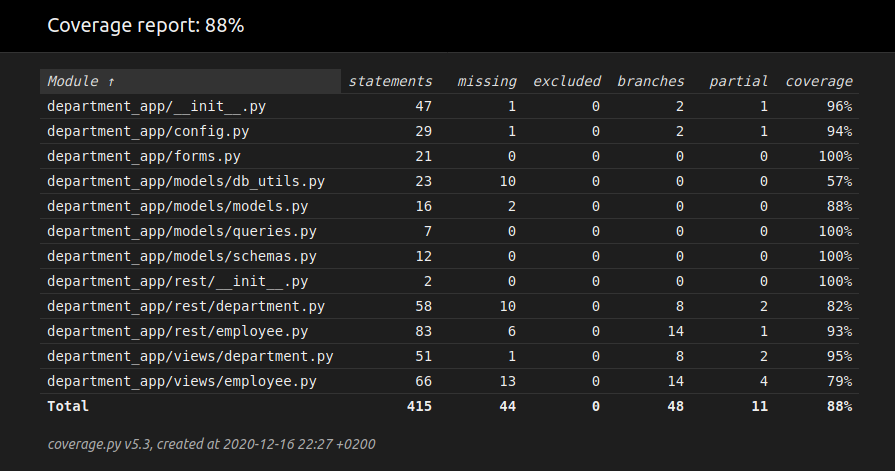

### How to build app
The easiest way to build the department app in my opinion is 
using docker. There is already a docker-compose-production 
file, and the only thing that is needed is to build docker 
containers using docker-compose (or just docker).

For production's utilization is good to use Nginx.

Additionally, is required .env file with next environment variables:
- SECRET_KEY;
- POSTGRES_USER;
- POSTGRES_PASSWORD;
- POSTGRES_HOST;
- POSTGRES_PORT;
- POSTGRES_DB.

### Coverage report

