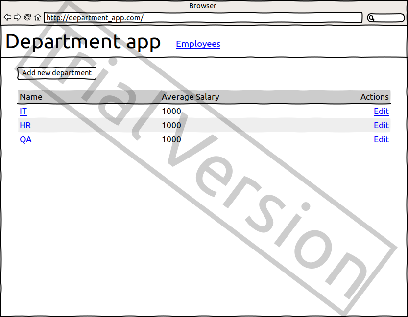
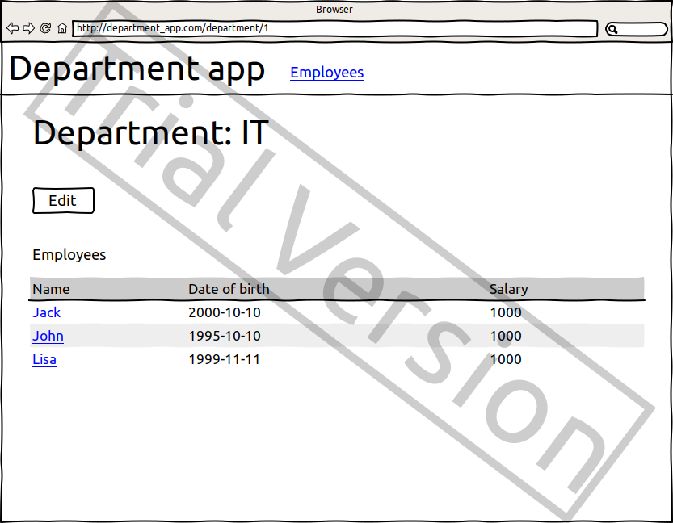
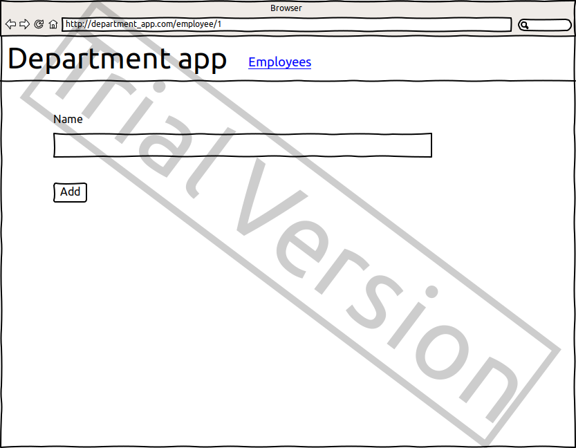
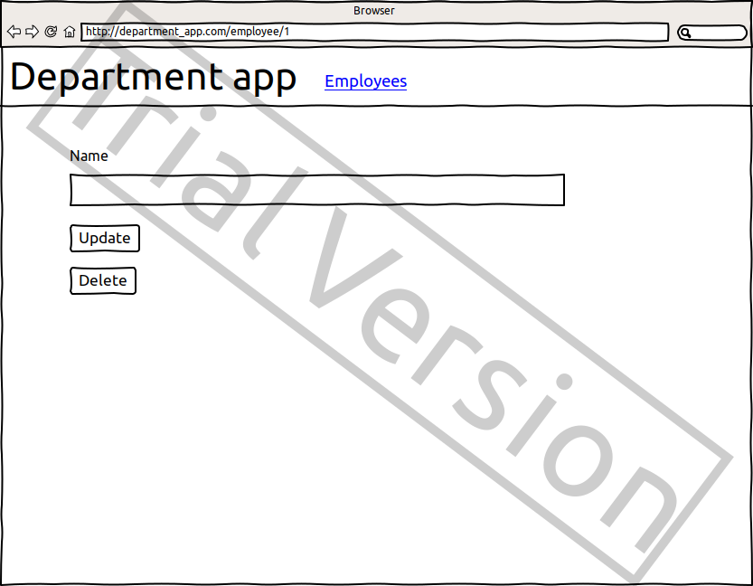
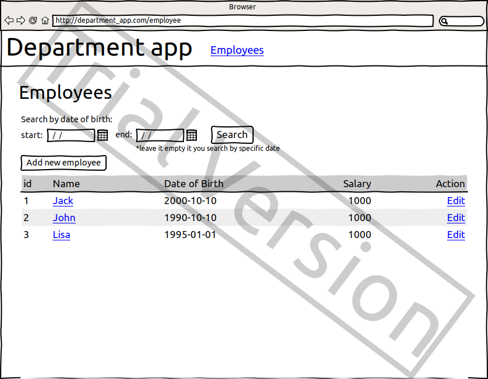
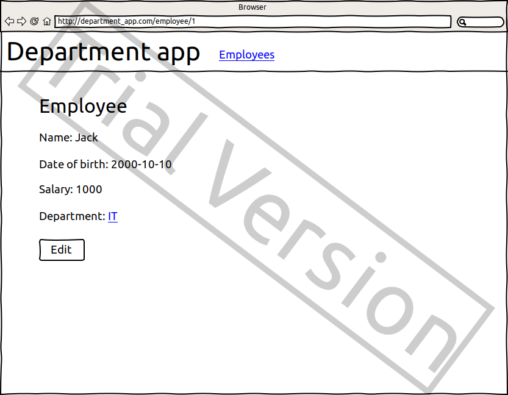
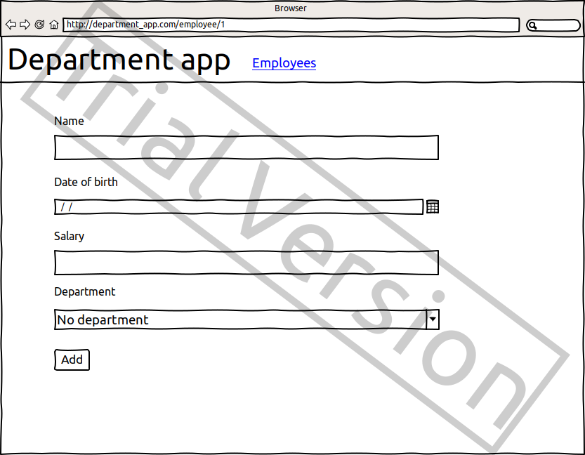
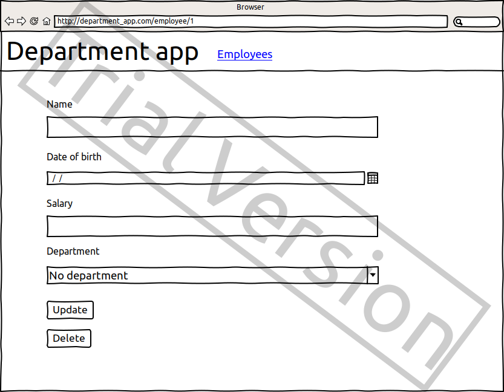

## Department App

#### Vision
"Department app" is web-application which allows users to manage
departments and employees data.

Application should provide:
- Storing departments and employee in a database;
- Display list of departments;
- Display department information;  
- Updating list of departments (adding, editing, removing);
- Display list of employees;
- Display employee information;  
- Updating list of employees (adding, editing, removing);  
- REST API for departments and employee;
- Filter employees by date of birth;
- Filter employees by a range of dates of birth;
- Filter employees by departments (API)
- Calculate average salaries in departments (API).

### 1. Departments

#### 1.2 Display list of departments
The mode is designed to view the list of departments with average salaries.

##### Main scenario:
- User goes to the application;
- Application displays a list of departments.

Pic. 1.1 View the departments list

The list displays the following columns:
- Name - unique department name;
- Average salary - average salary of all employee in the department;
- Action - link to edit department.

#### 1.2 Display department information

##### Main scenario:
- User click on a department name link in the department's list view;
- Application displays the department view.

Pic. 1.2 View the department.
The department view displays the following data:
- Name - department's name;
- Edit - button to edit department;
- Employees - list of the employees in the department with a 
  link to every employee view;

#### 1.3 Add department

##### Main scenario:
- User clicks the "Add new department" button in the 
  department's list view;
- Application displays form to enter department data;
- User enters department data and presses "Add" button;
- If the name field is not entered, data required message is displayed;
- If entered data is valid, then record is adding to database;
- If error occurs, then error message is displaying;
- If a new department record is successfully added, then a list 
  of departments with a success alert is displaying.

Pic. 1.3 Add department.

When adding a department, the following details are entered:
- Name - department's name

Constraints for data validation :
- Name - unique and maximum length of 64 characters;

#### 1.4 Edit department

##### Main scenario:
- User clicks the "Edit" link in the department's list view;
- Application displays form to enter department data;
- User enters department data and presses the “Update” button;
- If the name field is not entered, data required message is displayed;
- If entered data is valid, then edited data is added to database;
- If error occurs, then error message is displaying;
- If a new department record is successfully added, then a list 
  of departments with a success alert is displaying.

Pic. 1.4 Edit department

When adding a department, the following details are entered:
- Name - department's name

Constraints for data validation :
- Name - unique and maximum length of 64 characters;

#### 1.5 Removing department

##### Main scenario:
- User clicks the "Edit" link in the departments list view;
- Application displays form to enter department data;
- User presses “Delete” button;
- Record is deleted from database;  
- The list of departments with a success alert is displaying.

### 2. Employees

#### 2.2 Display list of employees
The mode is designed to view the list of employees.

##### Main scenario:
- User selects "Employees" link in a navigational panel;
- Application displays a list of employees.

Pic. 2.1 View the employees list

The list displays the following columns:
- Name - employee's name;
- Date of birth - employee's date of birth  
- Salary - salary of employee;
- Action - link to edit employee.

**Filtering by date:**
- In the employee's list view mode, the user sets 
  a date filter and presses the "Search" button. 
  User can filter by one date and by a range of dates;
- The application will show the employee with date 
  of birth for a certain period or date.
  
Restrictions:
- Start date of the period should be less than the end 
  date of the period;
- If end date is blank, then filtering by start date only;  

#### 2.2 Display employee information

##### Main scenario:
- In the employee's list view mode user clicks on an 
  employee's name link in the employee's list view;
- Application displays the employee view.

Pic. 2.2 View the employee.

The department view displays the following data:
- Name - employee's name;
- Date of birth - employee's date of birth;
- Salary - employee's salary;
- Department - department's name/link employee belongs to;   
- Edit - button to edit department.

#### 2.3 Add employee

##### Main scenario:
- In the employee's list view mode user clicks the 
  "Add new employee" button;
- Application displays form to enter employee data;
- User enters employee data and presses "Add" button;
- If any data is entered incorrectly, incorrect data messages are displayed;
- If entered data is valid, then record is adding to database;
- If error occurs, then error message is displaying;
- If a new employee record is successfully added, then a list 
  of employees with a success alert is displaying.

Pic. 2.3 Add an employee.

When adding a department, the following details are entered:
- Name - employee's name;
- Date of birth - employee's date of birth;
- Salary - employee's salary;
- Department - department employee belongs to.

Constraints for data validation :
- Name - unique and maximum length of 80 characters;
- Date of birth - employee's date of birth in a format dd/mm/yyyy.

#### 2.4 Edit employee

##### Main scenario:
- In the employee's list view mode user clicks the
  "Edit" link in the employee's list view;
- Application displays form to enter employee data;
- User enters employee data and presses “Update” button;
- If any data is entered incorrectly, incorrect data messages are displayed;
- If entered data is valid, then edited data is added to database;
- If error occurs, then error message is displaying;
- If a new employee record is successfully added, then a list 
  of employees with a success alert is displaying.
  

Pic. 2.4 Edit employee

When adding a department, the following details are entered:
- Name - employee's name;
- Date of birth - employee's date of birth;
- Salary - employee's salary;
- Department - department employee belongs to.

Constraints for data validation :
- Name - unique and maximum length of 80 characters;
- Date of birth - employee's date of birth in a format dd/mm/yyyy.

#### 2.5 Removing employee

##### Main scenario:
- In the employee's list view mode user clicks 
  the "Edit" link in the employee list view;
- Application displays form to enter employee data;
- User presses “Delete” button;
- Record is deleted from database;  
- The list of employees with a success alert is displaying.

## 3. REST API

Application implement all aforementioned functions in REST API.
